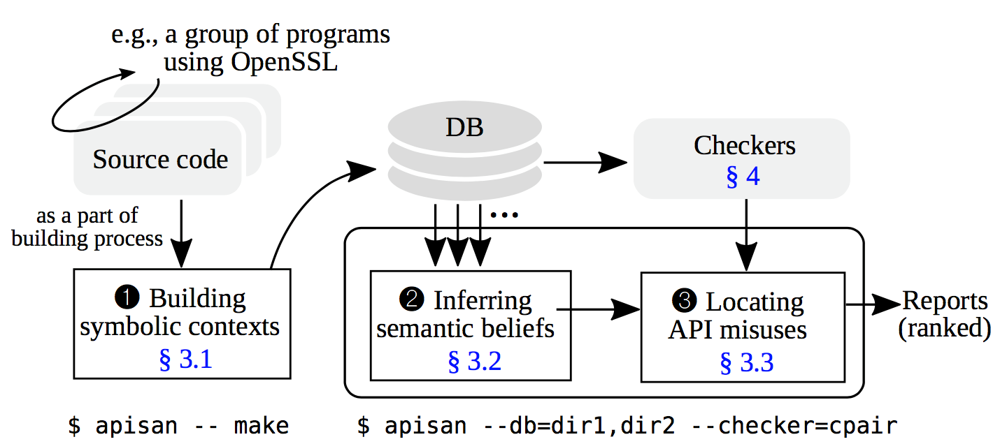
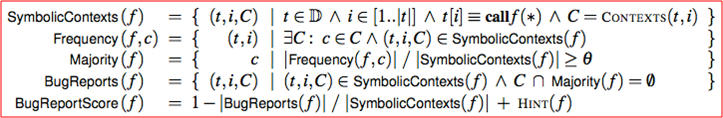

## 【发表会议刊物】
USENIX Security Symposium 2016
## 【作者信息】
Insu Yun, Changwoo Min, Xujie Si, Yeongjin Jang, Taesoo Kim, and Mayur Naik,
Georgia Institute of Technology

## Abstract

API滥用是一个众所周知的错误来源。其中一些（例如，SSL API的错误使用以及内存分配大小参数上的整数溢出）可能会导致严重的安全漏洞（例如，man-in-the-middle攻击和特权升级）。而且，现代API量大、复杂和发展迅速使其使用过程中容易出错。然而，现有的查错技术需要开发人员提供规范描述或者模型描述等人工干预活动，或者面临不能扩展到包含数百万行代码的大型真实软件的可扩展性差的问题。
本文提出了APISAN，可以自动化地从源代码中自动推断出正确的API使用模式的工具，而无需人工干预。 
APISAN设计的关键思想是通过考虑语义约束，从四个不同的角度，即API之间的因果关系、API参数间的语义关系、API的返回值和API使用时隐含的前置后置条件四方面，
来提取潜在正确的使用模式。 APISAN专门用于检查具有安全隐患的各种属性。作者将APISAN应用于9200万行代码，包括Linux内核和OpenSSL，发现76个以前未知的错误，并提供了所有错误的补丁。

## Introduction
通过分析源代码中API的不同使用方式，APISAN能够自动推测出语义正确性，即“语义信度”。
下图是APISAN找到的OpenSSL1.1.0-pre3-dev中的一个内存泄漏漏洞。

Line3为某公钥分配了内存单元gctx，随后被第四行的密钥生成操作EVP_PKEY_keygen_init()初始化。
但是若密钥初始化失败时，已分配的内存单元即gctx应该被EVP_PKEY_CTX_free()释放，否则导致内存泄漏发生。APISAN首先从该API在其他位置代码的使用模式中推测出语义正确的使用方式，然后提取出一个可检查的规则，即语义信度。这个新发现的漏洞已经被报告并在mainstream中被修复。
APISAN能够从右侧的代码数据库学习出正确的API使用模式，发现左侧代码中的漏洞。依据的原则是“主流的使用模式即为正确的使用模式”。

## Framework
APISAN的设计框架如下图所示。

首先基于已有的程序源码利用符号执行技术建立符号上下文，创建符号轨迹(traces)的数据库。然后，APISAN从轨迹数据库中通过4个维度（即API之间的因果关系、API参数间的语义关系、API的返回值和API使用时隐含的前置后置条件）推测出正确的API使用模式，即“语义信度”。推测出的“语义信度”被用于发现和排序出高风险的API误用位置并报告为漏洞。
### 建立符号上下文
APISAN执行符号执行来构建符号上下文，为每个函数调用捕获丰富的语义信息。 
在大型和复杂程序中构建符号上下文的关键挑战是克服符号执行中的路径爆炸问题。
为实现可扩展性，同时提取足够的符号上下文的信息，本文做出了两个重要的设计决策：
首先，APISAN在函数边界内进行符号执行。 
根据作者对APISAN的经验，限制程序间分析对于准确性和代码覆盖是合理的，因为大多数API使用可以在调用者函数中捕获，而不需要知道API内部代码。
其次，APISAN只展开每个循环一次，使得符号执行的结果能够有效地表示为没有后向边的符号执行树。
因为在实践中大多数API用法并不倾向于与循环变量相关。

### 推测语义信度
观察到的API使用模式越频繁，对此API用法的正确性的语义信念越强。
APISAN着重探索四种常见的API上下文模式。
1.返回值
函数不仅返回其计算结果，而且通常会通过返回值隐含计算的状态。
例如，Linux内核中的glibc和PTR_ERR()中的非零值。
2.参数
API的参数之间存在语义关系。
例如，内存拷贝操作复制大小应该小于或等于缓冲区大小。
3.因果关系
两种API可以是因果关系。
例如，所获取的锁应在临界区的末尾被释放。
4.条件
API语义可能意味着一定的前后条件。例如，仅当对等证书存在时验证此对等证书才有效。

### 语义信度排序
在收集上述API使用模式之后，APISAN在每个上下文下统计地推断出每个API函数的主流使用模式。
该计算在下图中详细描述。由于方法本质上是概率性的，所以存在误报。APISAN按照比例降序排列，优先考虑最有可能的错误。

## APISAN实现和评估
共约9K行代码（LoC），如下表1所示
基于Clang 3.6用于生成符号执行轨迹的C / C ++代码： 6K LoC
用于实现检查器和库的Python代码：3K LoC
经验性地选择了0.8作为阈值来决定是否将API使用模式标记为主流模式。

APISAN应用于
-Linux v4.5-rc4
-OpenSSL 1.1.0- pre3-dev
-PHP 7.0
-Python 3.6
-以及使用OpenSSL库的所有1,204个debian软件包。 
APISAN总共生成了40,006份报告，作者根据排名分析了报告。
发现了76个以前未知的错误:
-Linux中为64个
-OpenSSL为3个
-PHP为4个
-Python为1个
-debian包为5个

作者为所有错误创建了补丁，并将其发送给每个项目的主要开发人员。开发人员已经确认了69个错误，大多数错误已被应用到主线存储库。对于剩下的7个错误，正在等待回应。
所有错误都有严重的安全隐患，例如，代码执行，系统崩溃，MITM等。
对于Python（CVE-2016-5636）和PHP中的一些错误，包括整数溢出，作者可以甚至通过链接ROP小工具成功地利用它们。
此外，作者发现易受攻击的Python模块位于Google App Engine的白名单中，并将其报告给Google。

## 本文局限性
APISAN检测出来的bugs集合既不是完整的也不一定是正确的，即APISAN既存在漏报，也存在误报。

