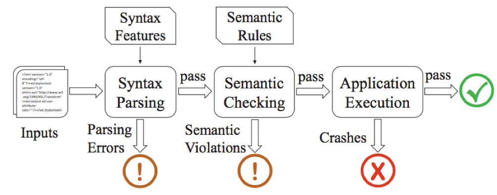
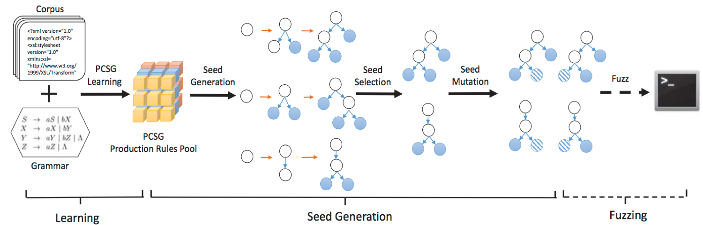
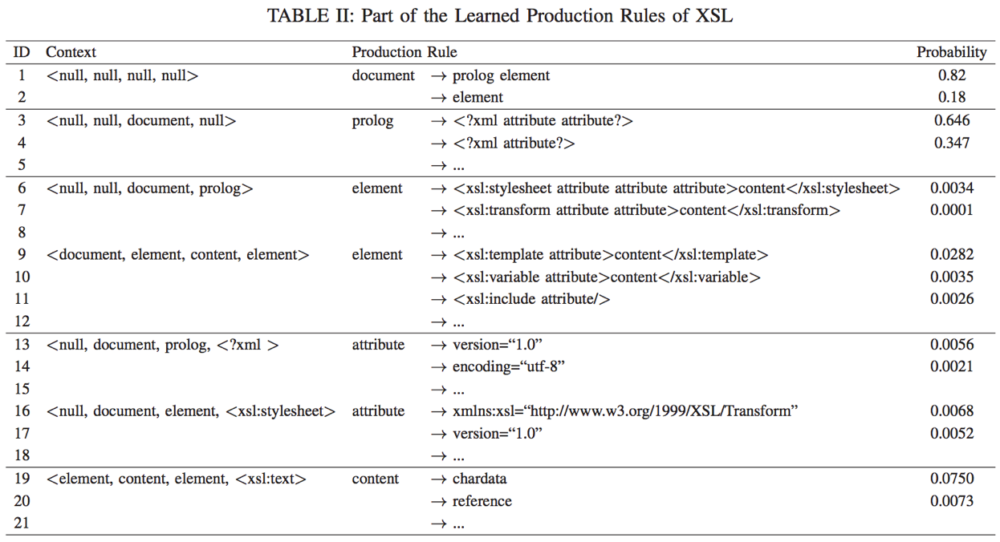
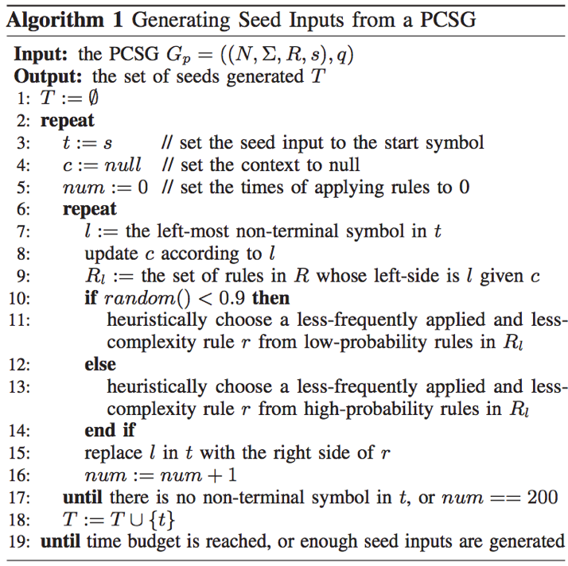

## 发表会议
IEEE Symposium on Security and Privacy 2017

## 作者信息
Junjie Wang, Bihuan Chen†, Lei Wei, and Yang Liu 
>* Nanyang Technological University, Singapore
>* {wang1043, bhchen, l.wei, yangliu}@ntu.edu.sg 
>* †Corresponding Author 

## 摘要
对于输入格式是高度结构化文件的程序来说，其处理流程一般是：语法解析--语义检查--程序执行。程序深层次的漏洞一般隐藏在程序执行阶段，
而对于自动化的模糊测试(Fuzzing)来说很难触发该类漏洞。 
该论文提出了一种数据驱动的种子生成方法，叫做Skyfire。Skyfire通过从大量的已知样本中学习而生成覆盖良好的种子作为Fuzzing的输入对处
理高度结构化输入的程序进行测试。Skyfire接收输入样本集合和文法，通过自动化学习PCSG（一种改了的上下文敏感的文法，包含语义规则和语
法特征），并利用其生成种子文件。 
本文利用收集的样本和Skyfire生成的种子作为AFL的seed对开源的XSLT、XML等引擎进行测试，证明skyfire生成的种子文件分布（提高了20%行覆
盖率和15的函数覆盖率）和发现漏洞能力。同时也对闭源的IE11的JavaScript引擎测试。其发现了19个内存破坏型缺陷和32个DOS缺陷。

## 背景介绍
Fuzzing是一种自动化的随机测试技术，其通过变异或者生成的方法生成大量的测试样本，并利用生成的测试样本对目标程序进行测试和监控，以发现
程序异常和缺陷。模糊测试的输入种子文件的质量是对测试效果的重要影响因素。 

	一个高效的Fuzzer需要实现大部分的生成样本可以到达处理执行阶段（execution stage)。

基于变异的方法是通过随机或者启发式的方法对合法的输入种子文件进行变异生成测试用例，大部分的生成用例在早起的语法检查阶段就被拒绝而导致
程序退出。然而，基于生成的方法是利用格式描述或文法描述来生成测试用例，可以快速的通过语法检查阶段，但是大部分程序在语义检查阶段也难以
通过，这都限制了这些方法难以挖掘程序的深层次漏洞。 

> 基于生成的方法能够实现对语法规则的描述和生成，但是想要通过语义规则确实非常困难的。一方面，对于不同的程序有不同的语义规则，编写的生
成规则难以复用，另一方面，这样的手动描述方法是非常耗时费力的，而且有时候甚至是难以实现的。 

本文使用一种扩展的上下文敏感的文法（包含语义信息和概率信息）来生成测试用例，并将其作为Fuzzer的输入进行测试。Skyfire面向的目标程序是接收高度结构化输入的程序，本文主要针对XSL、XML、JavaScript等开源引擎进行测试，很大的提高了测试代码覆盖率，并发现了16个新的漏洞。

## 方法概述
### 生成目标
* 生成正确的种子：能够通过程序的语法和语义检测
* 生成多样性种子：能够多样化的覆盖语法和语义规则
* 生成不常见种子：能够生成一般Fuzz生成不了的种子

### 处理过程
* 输入：输入是爬取的样本集合+程序的语法规则（ANTLR社区获得）
* PCSG生成：根据输入自动化抽取概率化上下文敏感语法规则
* 种子生成：根据抽取的规则采用左推导方法进行种子生成
* 种子选取：采用覆盖率作为衡量标准进行样本去重选取
* 种子变异：利用随机替换原则将同种类型的叶子节点进行变异

## PCSG学习

	Definition 1：CSG（context-sensitive grammar)是一个四元组Gcs = (N, Σ, R, s), 
	- N is a finite set of non-terminal symbols, 
	- Σ is a finite set of terminal symbols, 
	- R is a finite set of context-aware production rules of the form [c]α → β1β2...βn, α ∈ N, n ≥ 1, and βi (N∪Σ) for i=1...n, 
	  where c is the context in the form of ：
	  <type of α’s great-grandparent, type of α’s grandparent, type of α’s parent, value of α’s first sibling or type of α’s first sibling if the value is null  >
	- and s ∈ N is a distinguished start symbol
Example:
attribute→version=“1.0”, c=[null, document, prolog, <?xml]

### PCSG学习
* 自动从样本解析出AST
* 计算每种parent-children对在不同contexts下的次数
* 计算在一种context下的每种产生式规则的概率  
	q([c]α → β1β2...βn) = count([c]α → β1β2...βn)/count(α)  
	

	

## 种子生成
### 种子生成
#### 1. 利用左推导方法生成种子输入
迭代的进行下面操作，直至t中没有非终结符
* 从t中获取最左边的非终结符l和上下文信息c
* 从Rl中随机选取产生式规则r，
* 在t中对l进行r推导替换

#### 2. 推导过程的启发式应用
* 优先选取低概率的推导规则
* 限制同一个推导规则的使用次数，优先低频率应用的规则
* 优先低复杂度的推导规则
* 限制所有规则的应用次数

#### 3. 种子生成的算法

### 种子选取
对于开源程序使用gcov，对于闭源程序使用PIN进行覆盖率统计，并根据覆盖率进行种子去冗余筛选。

### 种子变异
SkyFire会对生成的种子进行Big-Step变异。这种Big-step的变异可以产生一般Fuzzer的small-step变异难以生成的种子。

* 从AST中选取叶子节点，并利用同种类型的叶子节点对其进行随机替换
* 只用右边是终结符的推导规则

## 实验
* 实验利用爬取的种子文件对libxslt、libxml2、Sabotron进行测试，测试能够有效发现漏洞，并且漏洞持续发现能力比直接用爬取的种子文件进行测试效果更好。
* 此外，测试的覆盖率等得到明显的效果。目前该方法对JavaScript语言的测试效果不是特别理想，需要进一步的改进。

## 总结
* 本文实现的数据驱动的种子生成方法利用文法和样本自动抽取语义信息，并利用语义信息和语法规则进行种子生成，能够保证生成种子文件通过语法解析和语义检查，能够执行到目标程序的更深的路径，从而更有效的发现深层次的漏洞。 
* Skyfire目前对于XML、XSL语言的应用效果很好，能够保证漏洞发现能力和覆盖率，但是对于JS这种较为复杂的语言应用不够理想。
