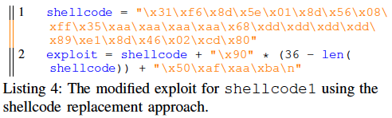

## 发表会议
IEEE Symposium on Security and Privacy 2017

## 作者信息
Tiffany Bao, Ruoyu Wang, Yan Shoshitaishvili, David Brumley
>* Carnegie Mellon University
>* UC Santa Barbara

## 背景
构造远程利用往往是漏洞攻击的终极目标，攻击者可以通过其在不经过物理访问的基础上即实现对受害者机器的攻击，如安装后门、窃取敏感信息。然而，构造一个远程利用并不那么容易，需要对漏洞有深入的了解、绕过远程机器上的防御措施等。因此，与其从头构造一个新利用，攻击者往往会使用一个现有的利用，通过相应的改造使其实现不同的攻击目标。这就是本文提出的“shellcode transplant”的概念，即将原始利用中的shellcode替换为自定义的shellcode，从而使得漏洞利用的最后一步去执行攻击者注入的shellcode，达到新的攻击目的。

然而“**shellcode transplant**”问题并不是那么容易，主要存在这三个**挑战**：
* 由于不存在明确的边界，难以将一个利用中的shellcode和其余部分分割开；
* 即使能将shellcode和利用其余部分分割开，又由于shellcode往往是通过复杂的数据转换得来的，因此重写利用中shellcode的部分为新的shellcode并不那么直接简单；
* shellcode和利用其余部分可能相互依赖，从而导致对新替换的shellcode存在潜在的约束，而当这个约束与shellcode本身约束相矛盾时就需要对利用或shellcode进行相应地修改，使得它能正常工作

之前的利用自动生成相关工作是通过将攻击者可用的内存添加约束为目标shellcode来实现的，但这种方法是不充分的。最坏情况下，当shellcode约束和路径约束相冲突时，这些方法就会降级为对程序进行纯符号执行，从而会面临路径爆炸等问题。而当存在已有利用的前提下，我们可以通过现有利用提供的信息来减少路径探索规模。

为此，本文实现了称为“**ShellSwap**”的系统，它可以自动处理shellcode移植问题。ShellSwap接收一个现有的利用、一个用户指定的替换shellcode作为输入，生成一个与原利用针对漏洞相同的但实现了用户指定功能的新利用。通过符号执行和静态分析方法解决了上面提及的三个挑战：
* 能够识别出利用中的shellcode；
* 能够恢复shellcode数据转换，即不受数据转换的限制；
* 能够解决replacement shellcode引入的约束冲突。
通过充分利用原先exploit提供的信息，结合创造性地转换shellcode，ShellSwap几乎不会降级为一个纯符号探索的方法，从而对比原先方法则会更加有效。在本文实验中，ShellSwap成功生成了88%的新利用，成功率几乎是已有方法的3倍。 

## 概览
本文针对的是控制流劫持类型的漏洞和利用。它包括两个阶段：
* 劫持前：设置程序状态state，使其能够实现劫持
* 劫持后：实施被注入的shellcode功能
我们将到达第一个阶段后的状态称为“**exploitable state**”（可利用状态），将到达可利用状态之前执行的程序指令序列称为“**exploitable path**”（可利用路径）。因此，如果我们能找到一个输入，它能沿着可利用路径执行，并在第二阶段能执行新的shellcode，那么这个输入就是我们想要的新利用。

上图是ShellSwap的整体框架，包括符号跟踪和shellcode移植两个模块。

### Symbolic Tracing（符号跟踪）
重放利用攻击过程并记录下执行的指令序列；然后在符号跟踪引擎中按照执行序列进行符号跟踪，即保证符号执行走的指令序列和具值执行一致，最后记录下执行到劫持点（即上述第一个阶段结尾）时执行路径的约束（称为Path Constraints）和当前状态（即上面的Exploitable State）。
但是什么时候才是到达了劫持点呢？本文是根据一个security policy的概念来定位劫持点的，即当执行的指令地址是被输入控制的，那么我们就认为程序进入了不安全状态，也就是这里所说的控制流被劫持了。
那怎么跟踪这一信息呢？直观且快速的方法就是使用动态污点分析，即识别指令地址被污染的时刻。但是这种方法没法跟踪路径约束，因此本文使用的是concolic执行，即具值执行与符号执行同时进行的方法。具体执行确定了要执行的路径，符号执行收集路径约束信息。这一步是基于driller的tracer模块实现的。

### Shellcode Transplant（shellcode移植）
这是ShellSwap的核心模块，接收可利用状态和路径约束、以及新shellcode作为输入，然后输出新利用或者显示无法生成新利用。具体细节结合下面例子中出现的困难再介绍。

下面就通过一个例子，来说明shellcode移植过程中会出现哪些困难。

例子中很明显存在栈缓冲区溢出，能够覆盖返回地址从而执行shellcode。下图是它的栈布局：

从string起始地址到返回地址之间有36字节，因此可以构造下图40字节的利用：

对于shellcode移植这个问题，一个最简单的想法就是找到原利用中shellcode所在的位置，然后按字节替换为目标shellcode。但是这个想法建立在2个假设前提下：
* shellcode在执行过程中没经过转换，仍保持输入时样式；
* 替换shellcode和原shellcode一样长。在前面的分析中，可以知道这两点要求在现实场景中难以总满足。

下面就针对示例程序讲2个替换shellcode的例子。

#### 例子1

对于这个新shellcode，直接按字节替换后的利用即为：

然而，这个利用并不能正常工作。这里shellcode有26字节，会覆盖到len和ret处，然而len所在内存在函数返回时会被更新，从而修改了shellcode的一部分，因此即使实现了控制流劫持，也无法执行目标shellcode的功能。

#### 例子2

原先利用执行到exploitable state时的路径约束是：输入前40个字节都不是\x00。这一约束是在执行下面这个for循环时添加的：

然而此时添加的shellcode约束，其中一条就是：输入的第二个字节为\x00（也就是我上面红框标记的）。
因此将路径约束和shellcode约束结合求解时，就会出现约束冲突，从而无法求解。

通过上面这两个例子，本文将shellcode移植过程中的问题归纳为两点：
* #### Memory conflicts
即处理漏洞触发时的内存布局问题。以前的工作中只是看能不能把整个shellcode放到内存中一整块连续空间，如果能放就添加shellcode约束并求解。但事实上，并不一定存在一块连续的足够大的符号内存可以存放shellcode。在上面例子1中，shellcode是26个字节长，理应可以放入50个字节的缓冲区；但是由于20-28字节处的值最终会被覆盖、36-40字节处必须是shellcode的地址，从而将50字节分割为3块符号内存（分别是20字节、8字节、10字节长），没有一块能够放得下26字节长的shellcode，从而导致了内存冲突。

* #### Path conflicts
为了能够执行到可利用状态，输入必须满足路径约束；但为了使得新利用最终执行用户提供的shellcode，又必须在可利用状态的内存中添加shellcode对应的约束。然而，路径约束和shellcode约束可能发生冲突，如果我们丢弃了路径约束去生成输入的话，那么新生成的输入执行时就会走其他路径，从而可能就无法触发漏洞了。

因此，下面就着重介绍本文是如何识别和解决约束冲突，即上面的Shellcode Transplant模块。 

## Shellcode Transplant

上图是该模块的整体流程。主要分为4步：
* 预处理：识别可利用状态时的内存中所有可存放shellcode（或shellcode指令片段）的连续符号缓冲区（即该缓冲区中每个字节都是符号值）。
* 内存矫正：通过语义等价的调整来修复内存冲突问题，即当某条shellcode指令无法在当前地址存放／放在当前地址会产生路径冲突时，可通过jmp指令跳转至其他位置；当所有shellcode指令都无冲突地放置成功了，那么就意味着成功生成了新的利用，程序结束。
* 路径揉合：当出现路径冲突时，通过识别其他既能解决冲突又仍能触发漏洞的路径，以该路径为exploitable path，从而生成新的可利用状态和新的路径约束，再回到第一步。
* 两阶段的备用：当第三步中找不到满足要求的新路径时，就执行一个两阶段的备用shellcode，第一阶段是一个比较短的shellcode，它的功能是用于读取第二段的shellcode放置内存，并将控制流转向第二段shellcode去执行；由于远程利用中当程序触发漏洞后可能会关闭网络连接，或者受害者机器存在其他的保护机制来截断通信，从而这种方式并不一定可行，因此本文认为它只是一种备选／回退的方案。对此，作者编写了一个较短的第一阶段的shellcode（下图所示），通过read系统调用来读取用户想执行的shellcode，并放在栈返回地址上方，从而跳转执行。

下面着重介绍中间两步。

### Layout Remediation
内存冲突主要是由于shellcode太大，从而无法在一块内存块存放导致的，因此本文通过将shellcode当成一条条指令序列来分析，每次只需考虑如何放入一条指令即可。本文实现了一个称为Locate()的函数，用于在a的位置处放置第i条shellcode指令。
 
 
Locate()的主要逻辑：如果能在a地址处放置SH[i]，并且添加的shellcode约束和路径约束不冲突，则成功放置并调用Locate放置下一条指令；如果约束冲突的话，则通过调用Hop()跳转至其他位置放置SH[i]，若成功也继续放置SH[i+1]，失败则返回Not Found；如果一开始不能在a地址处放置SH[i]的话，也返回Not Found。

 
Hop()的主要逻辑：在a地址处放置jmp指令，并在a+jmp之后找位置存放SH[i]，若找到并shellcode约束、jmp指令约束、与路径约束三者之间均不冲突则认为可以通过jmp后放置SH[i]，若出现冲突则在jmp之后再放置一条jmp，然后再跳转至存放SH[i]的地方；不断循环直到没地方放置SH[i]的话，则回滚至上一条指令放置之前，即撤销SH[i-1]放置的位置，对SH[i-1]也通过jmp来放置，放置完SH[i-1]后再去考虑放置SH[i]，直到回滚到SH[-1]为止则认为Hop()失败。

下面通过之前的例子1来展示下： 
 
 
* 前24个字节都是符号值，因此属于同一块，故而会执行到(b)，也即是成功放置了shellcode1[0:7) ；
* 当放shellcode1[7]时由于ret不是符号值，此处不能存放，所以调用Hop()，变成了(c)；
* 又由于jmp指令也不能放在ret的位置，因此回滚至放置shellcode1[6]之前，通过jmp方式重新放置shellcode1[6]，即(d)；
* 此时jmp放在len位置了，len和输入相关，其相关性会出现了state的约束中，而这里又令len中部分字节等于jmp指令对应字节，从而出现了约束冲突的情况，因此再次回滚，重新放置shellcode1[5]；
* 放完之后jmp指令仍有一部分出现在len内存处，即仍存在冲突，故继续回滚重新放置shellcode1[4]，即(e)；
* 此时不存在任何冲突，则继续调用Locate()来放置shellcode1[5, 6, 7]，最终是下图的(f)状态。

### Path Kneading
当Layout Remediation返回Not Found时，就进入了这一阶段，表示通过上述策略仍然无法放置某条指令（假设为SH[i]），即SH[i]添加的shellcode约束（称为c）与路径约束（称为C）存在冲突。此时我们从C中找到与c发生冲突的最小子集S（这里通过分治的方法去找），对于子集S中的每条约束找到引入该约束的指令/分支，通过走反方向分支从而使得约束取反，从而能够解决约束冲突问题。但走了反向分支后程序可能就无法执行到劫持点了，便不能执行shellcode，因此我们需要将程序执行流程仍扭转回原来路径上的节点。本文通过计算CFG中反向分支（下图的nc'）的后继节点中会出现在原始路径上的节点（nd, nd+1），对于每个满足条件的后继节点依次考虑建立从反向分支到该节点的路径（ G(nc’, nd) ）；一旦沿着这条路径走，我们便即能处理约束冲突，又能执行回原始路径，即进一步可能能执行到劫持点，生成新的路径约束和状态，重新回到第一步开始放置shellcode。若这一步失败了的话，则使用备选的two-stage的shellcode方案。
 

## 实验
本文面向的实验环境是CGC环境，包括11个二进制程序，20个原始的利用，5个替换shellcode（其中1个作者自己构造的）。
本文为了做对比实验，重现了已有方法（称为SystemM），基本思路一致，但是已有方法只考虑将shellcode整体放入一个连续的内存块，一旦不能找到这样的内存块或者找到后存在约束冲突的话，则认为任务失败。 
 
**实验结果**:
* ShellSwap的成功率为88%，而SystemM只有31%；其中Layout Remediation策略产生了57个新利用，而应用了 Path Kneading策略后又能产生31个新利用。 
 
* 本文还对SystemM也添加了Layout Remediation功能，实验结果增加了26条新利用，说明了该策略的有效性。
* 本文还对20条原始利用直接使用two-stage fallback方法，能够对19条成功移植，这是因为其中第一阶段的shellcode比一般用户提供的替换shellcode要来的短，只有19字节。
* 本文还对每条替换shellcode评估了它们针对不同利用的平均成功率，显示shellcode越短，成功率越高。
 
* 性能上，Layout Remediation非常快，而Path Kneading则是性能瓶颈，因为多次迭代的符号跟踪。
 

## 结论
* 本文引入了一个自动shellcode移植的问题，即给定一个有漏洞的程序、一条利用、一个用于替换的shellcode，如何生成一个会执行给定shellcode的新利用。
* 为此，本文实现了一个对应的系统ShellSwap，使用了Layout Remediation和Path Kneading两个策略来实现内存和路径的冲突，从而在100个测试场景下成功生成了88条新利用。
* 本文的结果意味着利用生成不再需要太多的技巧和专业知识，甚至连不懂利用知识的受害者也可以生成自己的利用。
