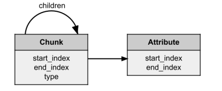
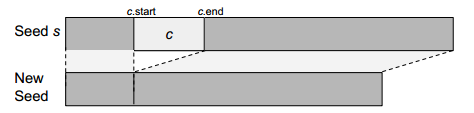
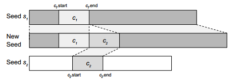
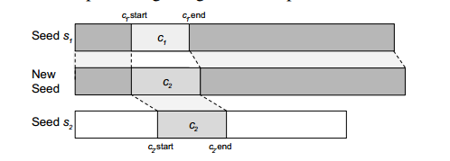
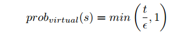
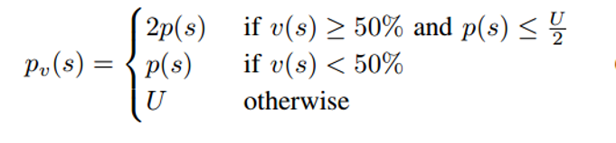
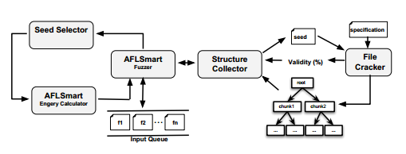
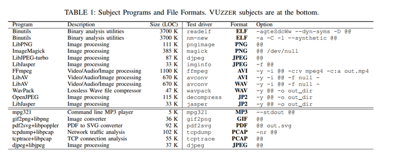
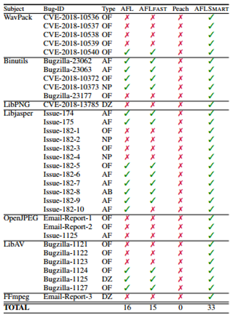
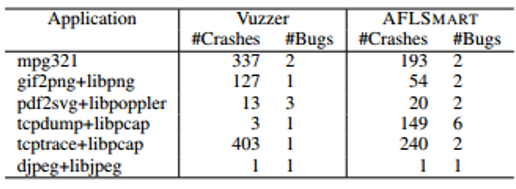

## Abstract
CGF（coverage-based grebox fuzzing）是一种在自动化漏洞检测方面很成功的方法。通过给定种子文件，CGF能够随机的进行翻转，删除bit来生成新的文件。CGF通过保留那些增强覆盖率的生成文件来迭代地构建（和fuzz）种子语料库。然而，随机地bit翻转对于处理复杂文件格式的应用，可能不会产生有效的文件。
在本文中，我们介绍一种smart gerybox fuzzing（SGF）能够通过对种子文件进行高结构化的表示来生成新文件。我们定义了在虚拟文件结构上进行变异操作的方法，而不是在bit级别上的变异。这种SGF能够探索完整的新输入区域并且能够保证文件的完整性。我们引入了一种新颖的基于有效性的能力调度，使SGF能够花更多的时间生成更有可能通过程序解析阶段的文件，这可以让我们找到程序逻辑更深处的漏洞。
## Motivation
许多安全关键的程序和库都是处理高度结构化的输入。例如，图片、音频、视频、数据库、文档或者电子表格文件等。CGF的变异操作往往都是bit级别的，容易生成无效的种子输入。
## Implement
### Virtual structure
我们引入了一个轻量级的数据结构化表示-虚拟结构。每个输入文件表示成一个颗解析树。树上的节点代表chunk或者attribution。chunk是树的内部节点，attribution是树上的叶子节点。

每个chunk包含start和end-index，表示在文件中的起始和结束字节序列位置。type表示chunk的类别，用于与其他chunk区分（eg：fmt chunk or data chunk）。每个chunk包含0个或者多个chunk作为孩子节点，同时也可以是0个或者多个attribution。attribute代表了文件中与结构无关的重要数据。
### Smart Mutation Operators
**Smart deletion：** 删掉一个chunk，并将后面的索引修改。

**Smart addition：** 随机选择另一个seed s2, 并随机选择其中一个chunk C2放入到S1中，与C2的parent type相同的chunk内。

**Smart splicing：** 随机在S1和S2中选择两个type相同的chunk，将C2替代C1。

### Stack mutations
为了生成interesting种子，将结构化变异和bit级别的变异一起使用是很有意义的。对于结构化变异，我们需要将文件和文件的虚拟结构同步更新，一个chunk的删除可能会影响到他的父节点的end_index。
### Deferred Parsing
在实验中发现，虚拟结构的构建开销较大，解析输入只需要数秒。若是为每一个种子都构建虚拟结构，那么SGF的效率比传统的灰盒fuzz要差。为了克服这个问题，我们提出了一种deferred parsing的方法。

**prob：** 表示给种子s构建虚拟结构的概率

**t:** 上一次发现新路径的时间

**ε：** 阈值

当t>ε 时，构建新的虚拟结构。即，在小于ε时，采用bit-level变异；大于ε时，构建虚拟结构，使用结构化变异。
### Validity-based Power Schedule
power schedule决定了一个种子的energy，即一个种子能够fuzz的次数。在AFL的power schedule的基础上，我们提出了一种爬山算法：

**Degree of validity v(s) of a seed：** 文件能够被解析的部分；
未能解析的部分，会用一个chunk表示。

**p(s):** 传统灰盒fuzz（AFL）的power schedule

**U：** AFL能够分配的最大值
### File Format Specification
针对许多文件结构做了大量的研究后，总结出构建虚拟结构的一些要点如下：
**Chunk inheritance：** 先创建一个所有文件格式都适用的普通chunk。再构建具体的chunk，集成普通chunk，在chunk中添加不同的attribute。

**Specification completeness：** 针对chunk结构变异操作，构建virtual Structure时，可以不需要规范化chunk中所有属性。其中的chunk data可作为blob存储。

**Relaxed constraints：** 与解析结构无关的约束可以省略。即，chunk可以以任何顺序出现；chunk可以没有（包括强制的）；unknown chunk可以出现；一种类型的chunk可以出现多次。
### AFLSmart implement

在AFL基础上进行了扩展，添加并修改了4个模块：
File cracker：解析输入文件，并分解成data chunk和data attibute。并计算输入文件的有效性，即文件有多少能够正确解析。

Structure Collector：收集有效部分，并且分解成chunk和属性。

Energy Calculator：计算power schedule

AFLSmart Fuzzer：在chunk level进行变异，并且支持bit-level变异。
## Experimental
### Research Question
SGF vs traditional greybox fuzzing: 与AFL 和AFLFAST比较

SGF vs smart blackbox fuzzing: 与Peach比较

SGF vs taint analysis-based greybox fuzzing:  与Vuzzer比较
### Subject Programs

### Experimental result
与AFL、AFLSmart比较：
- SGF 发现33 0-day漏洞
- AFL 和AFLSmart 仅发现16个
与peach比较：
- 在12个项目中比peach都表现的要好
与Vuzzer比较：
- 发现16个bug

